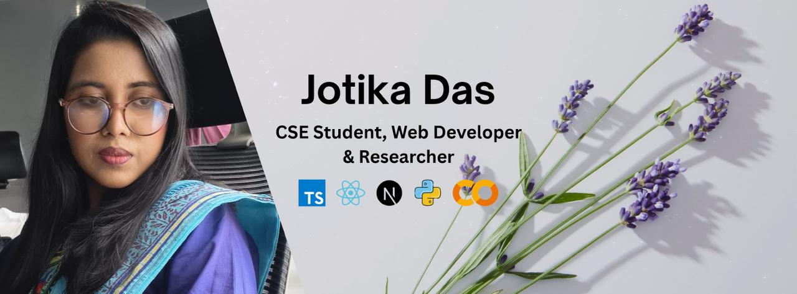

<!--- banner --->

  

 

<!--- title --->

  <ul align="center">
    
<h1 style="display: inline-block">Hi 👋, I'm Jotika Das</h1>

    
  </ul>

 

<!--- about --->
- 👋 Hi, I’m **[@jotika-meaw](https://github.com/jotika-meaw)** — a **Web Developer** and CSE student from Chattogram, Bangladesh.
- 🎓 Currently in my **6th Semester of Computer Science & Engineering** at **University of Science & Technology Chittagong (USTC)**.
- 🖥️ Currently working with **Python, JavaScript, TypeScript, React, Next.js and Tailwind CSS**.
- 🤖 Interested in **Machine Learning, Deep Learning, NLP, Computer Vision and intelligent web applications**.
- 🛠️ Currently learning **Machine Learning models, IELTS and advanced Web Development**.
- 💬 Ask me about **Python, React, Next.js, ML basics and Web Development**.
- 🌐 Explore My Work **[Repositories](https://github.com/jotika-meaw?tab=repositories)** and connect on **[LinkedIn](https://www.linkedin.com/in/jotikadas)**.
- 📫 Feel free to reach me out at **[jotikadas57@gmail.com](mailto:jotikadas57@gmail.com)**.

 

<!--- socials --->
## <b> FOLLOW ME ON SOCIALS:</b>

  

    
    
    
  

 

<!--- technology --->
## <b> TECHNOLOGY STACK:</b>

### Languages:

### CSS Frameworks & Libraries:

### JavaScript Frameworks & Libraries:

### Database & Model:

### Machine Learning & AI:

**Libraries & Tools:** Scikit-learn · XGBoost · Hugging Face Transformers · SHAP

### Deployment Platform:

### Design & Graphics:

### Tools & Technologies:

 

<!--- statistics --->
## <b> GITHUB STATISTICS & ANALYSIS:</b>

### GitHub Contributions:

### GitHub Statistics:
|  |  |
| ------------- | ------------- |

### Streak & Activity:
|  |  |
| ------------- | ------------- |

 

## 🚀 FEATURED PROJECTS

### 1. 🗳️ Voting System App

> Streamlit web application to explore five voting systems (FPTP, Approval, Preferential, Condorcet and Borda) with interactive inputs and animated results.

**Technology:** Python, Streamlit

🔗 [View Repository](https://github.com/jotika-meaw/voting_system_app)

**Live Demo:** [votingapp.streamlit.app](https://votingapp.streamlit.app)

---

### 2. 🌐 Web Development Projects

> A collection of web development projects created while learning and practicing modern web technologies.

**Technologies:** HTML · CSS · JavaScript · React · Next.js · Tailwind CSS

🔗 [View My Repositories](https://github.com/jotika-meaw?tab=repositories)

---

### 3. 🛒 EBT E-Commerce

> E-commerce web project focused on creating a structured and responsive online shopping experience.

**Technologies:** HTML · CSS · JavaScript

🔗 [View Repository](https://github.com/jotika-meaw/EBT-ECommerce)

**Live Demo:** [jotika-meaw.github.io/EBT-ECommerce](https://jotika-meaw.github.io/EBT-ECommerce/)

---

### 4. 🔗 FitLog - Workout Library

> Dark-themed workout planning app: browse twelve lifts, build a capped daily plan and track the week's work.

**Technologies:** Next.js, React, TypeScript, Tailwind CSS

🔗 [View Repository](https://github.com/jotika-meaw/assignment_final_6)

**Live Demo:** [jotika-meaw.github.io/assignment_final_6](https://jotika-meaw.github.io/assignment_final_6/)

---

### 5. 🔗 Dev Stack Builder

> Explore development technologies and build your own custom tech stack, with duplicate prevention and toast feedback.

**Technologies:** React, Vite, JavaScript, React-Toastify

🔗 [View Repository](https://github.com/jotika-meaw/devstack-assignment)

**Live Demo:** [devstack-assignment.vercel.app](https://devstack-assignment.vercel.app)

 

<!--- random quote --->
## <b> RANDOM DEV QUOTE:</b>

---

<!--- visit count --->

  

  <b>Thanks for visiting my profile! 🚀</b>

  <i>Let's build something meaningful with technology.</i>

